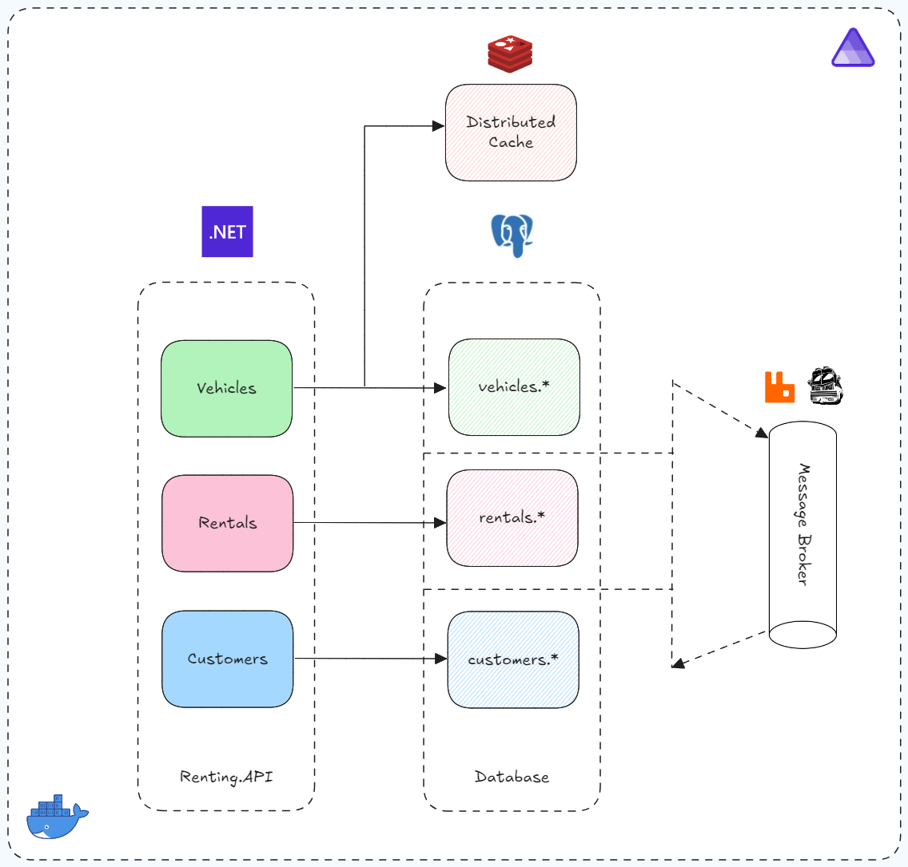
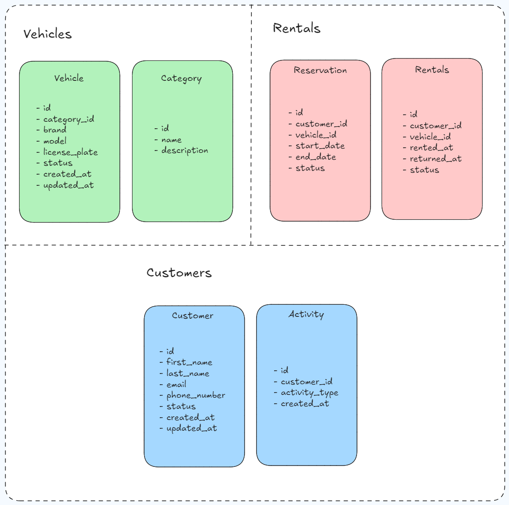

# 🚗 **GtMotive.Renting**

## 📖 **Descripción del Proyecto**
**GtMotive.Renting** es un sistema diseñado para gestionar de manera eficiente el proceso de alquiler de vehículos. Basado en una arquitectura **Monolítica Modular**, combina los principios de **Clean Architecture** con una estructura modular que asegura:
- Separación clara de responsabilidades.
- Alta mantenibilidad.
- Escalabilidad a futuro.

### 🔑 **Módulos Principales**
El sistema está organizado en módulos independientes que facilitan su desarrollo, prueba y despliegue:
- **Vehicles**: Gestiona la flota de vehículos y sus categorías.
- **Rentals**: Gestiona los alquileres de los vehículos.
- **Customers**: Gestiona la información de los clientes.

---

## 🚀 **Opciones para Iniciar el Proyecto**

- **⚙️ Docker Compose**: Configura y orquesta los servicios necesarios (base de datos, caché y mensajería) en un entorno integrado. Para ello, selecciona **docker-compose** como el proyecto de inicio en tu entorno de desarrollo.
- **🌟 .NET Aspire**: Un conjunto de herramientas, plantillas y paquetes para crear aplicaciones observables y listas para producción. Selecciona **GtMotive.Renting.AppHost** como el proyecto de inicio.

---

## 🛠️ **Arquitectura**
GtMotive.Renting adopta una arquitectura **Monolito Modular**, que agrupa toda la funcionalidad en un único despliegue, pero con una organización interna que permite trabajar con módulos desacoplados. Esto asegura:
- **Separación de responsabilidades**: Cada módulo tiene sus propias reglas y lógica, reduciendo el impacto de los cambios.
- **Escalabilidad interna**: Fácil integración de nuevos módulos sin afectar a los existentes.
- **Flexibilidad y mantenibilidad**: Siguiendo los principios de **Clean Architecture**, cada módulo está organizado en capas bien definidas.

---

## 🧰 **Tecnologías Utilizadas**
El proyecto utiliza un conjunto robusto de tecnologías para garantizar su desempeño y escalabilidad:

- 🖥️ **Framework**: .NET Core 8  
- 🗄️ **Base de Datos**: PostgreSQL  
- ⚡ **Cache Distribuida**: Redis  
- 📩 **Mensajería**: RabbitMQ  
- 📚 **Librerías**: MediatR, FluentValidation, EntityFramework, MassTransit.
- 🧩 **Patrones**: CQRS, DDD, Mediador, SOLID.  
- 🛠️ **Orquestación**: Docker Compose y .NET Aspire  

---

## ⚡ **Funcionalidades**

### 🚗 **Módulo: Vehicles**
- **Crear Vehículo**: Registro de nuevos vehículos en la flota.
- **Obtener Vehículos**: Obtener vehículos de la flota.
- **Crear Categoría**: Registro de nuevas categorías de vehículos.
- **Obtener Categorías**: Obtener categorías de vehículos.

### 📅 **Módulo: Rentals**
- **Iniciar Alquiler**: Inicia el proceso de alquiler de un vehículo.
- **Finalizar Alquiler**: Registra la devolución del vehículo y cierra el alquiler.
- **Obtener Alquileres**: Obtener listado de alquileres.

### 👤 **Módulo: Customers**
- **Registrar Cliente**: Creación de perfiles de clientes.
- **Consultar Clientes**: Obtener información de los clientes registrados.

---

## 📝 **Reglas de Negocio**
1. Un vehículo no puede ser alquilado si su antigüedad supera los 5 años desde su fecha de fabricación.
2. Un mismo cliente no puede alquilar más de 1 vehículo al mismo tiempo.
3. Solo los vehículos con estado `disponible` pueden ser reservados o alquilados.

---

## 📐 **Arquitectura del Sistema**

---

## 🗂️ **Diagrama de Entidades**

---

## ✅ **Tests**
El proyecto incluye pruebas enfocadas en el modulo de **Rentals** para garantizar su calidad y estabilidad:

- 🔍 **Tests Unitarios**: Validan la lógica en componentes aislados.
- 🌐 **Tests de Integración**: Verifican la interacción entre módulos y servicios.
- 🧱 **Tests de Arquitectura**: Garantizan que el proyecto sigue los principios establecidos.

---